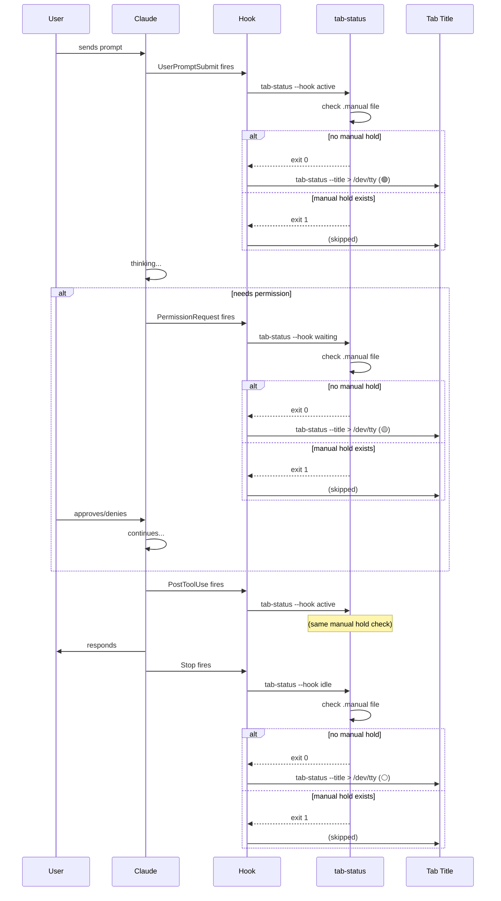
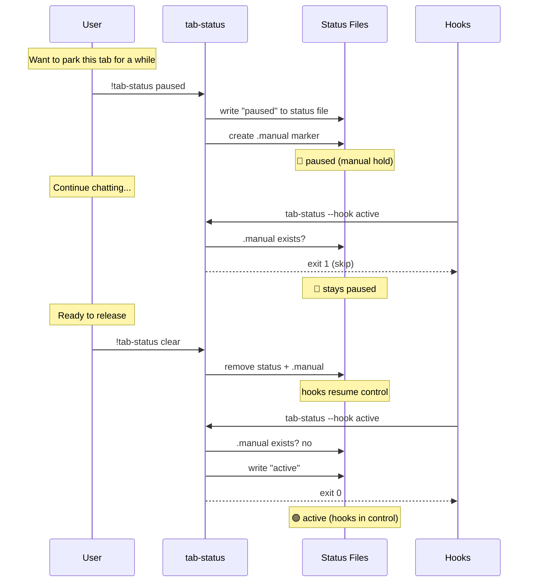
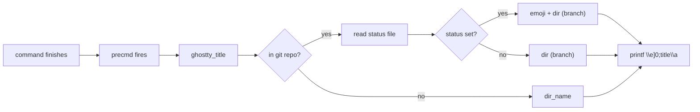

# Tab Status System

Visual status indicators in Ghostty tab titles for multi-Claude workflows.

## Components

```
tab-status (CLI)          ~/.local/bin/tab-status
set-title.sh (shell)      ~/.config/ghostty/set-title.sh  (sourced by .zshrc)
Claude hooks              ~/.claude/settings.json
Status files              ~/.claude/tab-status/<worktree>
Manual hold files          ~/.claude/tab-status/<worktree>.manual
```

## How Automatic Status Works (Claude Hooks)



## Manual Override Flow



## Shell Prompt Integration (outside Claude)



## Statuses

| Status | Emoji | Meaning | Set by |
|--------|-------|---------|--------|
| active | 🟢 | Claude is working | Hook (UserPromptSubmit, PostToolUse) |
| waiting | 🟡 | Permission prompt, need your input now | Hook (PermissionRequest) |
| idle | ⚪ | Your turn, no rush | Hook (Stop) |
| paused | 🔵 | Parked, will return later | Manual |
| blocked | 🔴 | Can't proceed, external dependency | Manual |
