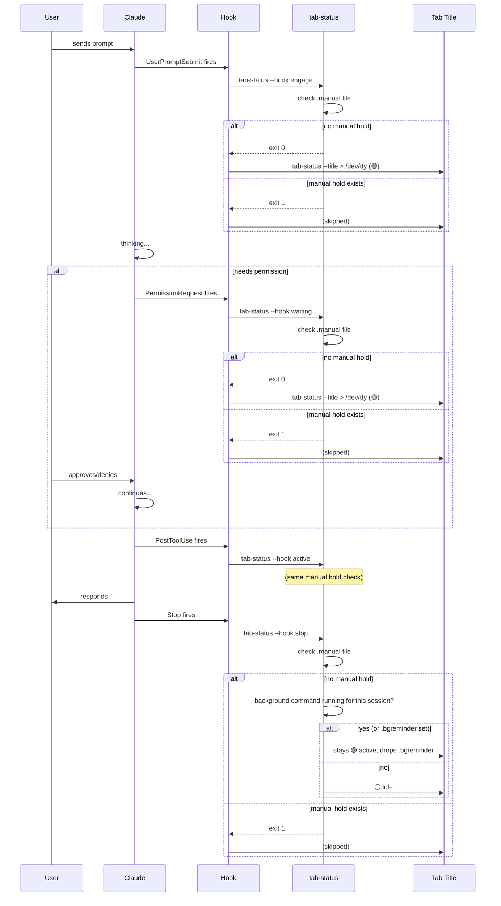
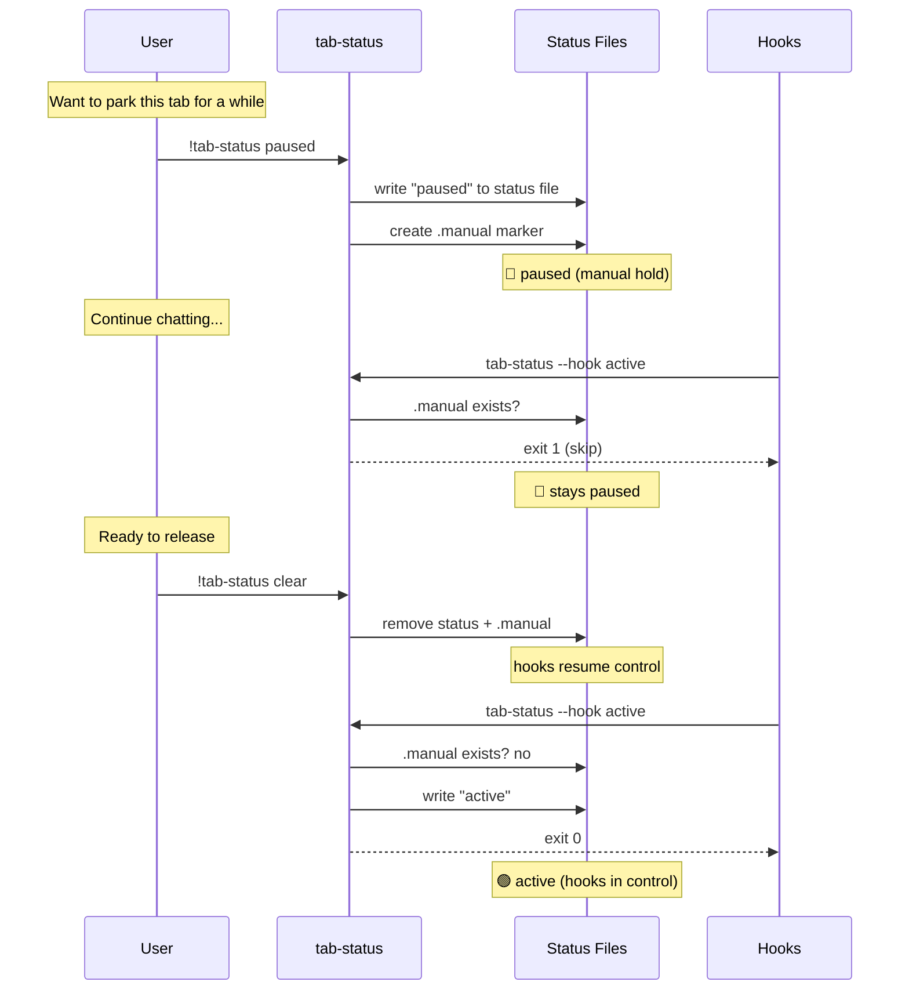
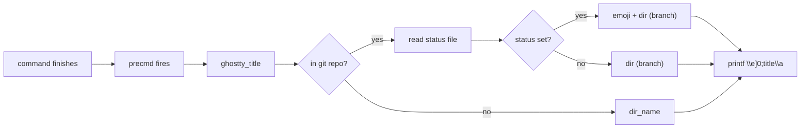

# Tab Status System

Visual status indicators in Ghostty tab titles for multi-Claude workflows.

## Components

```
tab-status (CLI)          ~/.local/bin/tab-status
set-title.sh (shell)      ~/.config/ghostty/set-title.sh  (sourced by .zshrc)
Claude hooks              ~/.claude/settings.json
Status files              ~/.claude/tab-status/<worktree>
Manual hold files          ~/.claude/tab-status/<worktree>.manual
```

## How Automatic Status Works (Claude Hooks)


```mermaid
sequenceDiagram
    participant U as User
    participant C as Claude
    participant H as Hook
    participant TS as tab-status
    participant T as Tab Title

    U->>C: sends prompt
    C->>H: UserPromptSubmit fires
    H->>TS: tab-status --hook engage
    TS->>TS: check .manual file
    alt no manual hold
        TS-->>H: exit 0
        H->>T: tab-status --title > /dev/tty (🟢)
    else manual hold exists
        TS-->>H: exit 1
        H->>T: (skipped)
    end
    C->>C: thinking...
    alt needs permission
        C->>H: PermissionRequest fires
        H->>TS: tab-status --hook waiting
        TS->>TS: check .manual file
        alt no manual hold
            TS-->>H: exit 0
            H->>T: tab-status --title > /dev/tty (🟡)
        else manual hold exists
            TS-->>H: exit 1
            H->>T: (skipped)
        end
        U->>C: approves/denies
        C->>C: continues...
    end
    C->>H: PostToolUse fires
    H->>TS: tab-status --hook active
    Note over TS: (same manual hold check)
    C->>U: responds
    C->>H: Stop fires
    H->>TS: tab-status --hook stop
    TS->>TS: check .manual file
    alt no manual hold
        TS->>TS: background command running for this session?
        alt yes (or .bgreminder set)
            TS->>T: stays 🟢 active, drops .bgreminder
        else no
            TS->>T: ⚪ idle
        end
    else manual hold exists
        TS-->>H: exit 1
        H->>T: (skipped)
    end
```

## Background Commands (the "go back" nudge)

Claude runs every Bash call detached in its own session. A *backgrounded*
command (`run_in_background`) keeps running after Claude goes idle — but it's
process-wise identical to a foreground one. The tell is timing: at **Stop**,
Claude isn't running anything in the foreground, so any live shell-snapshot
child of this session's `claude` pid is necessarily a background command. Its
PPID is exactly that claude pid, so detection is per-session.

When `stop` sees one, the tab **stays green instead of going idle** and drops a
`<worktree>.bgreminder` marker — a "work's still cooking, come back" nudge. The
reminder keeps the tab green *even after the command finishes*; it's cleared
only when **you** re-engage (`UserPromptSubmit → engage`), not by Claude's own
autonomous tool use (`PostToolUse → active`). So the tab only settles to ⚪ idle
once you've returned **and** Claude has come to a real standstill.

(Caveat: a background command that finishes before the turn-ending Stop fires is
never seen — only commands still alive at a Stop trigger the nudge.)

## Manual Override Flow


```mermaid
sequenceDiagram
    participant U as User
    participant TS as tab-status
    participant F as Status Files
    participant H as Hooks

    Note over U: Want to park this tab for a while
    U->>TS: !tab-status paused
    TS->>F: write "paused" to status file
    TS->>F: create .manual marker
    Note over F: 🔵 paused (manual hold)

    Note over U: Continue chatting...
    H->>TS: tab-status --hook active
    TS->>F: .manual exists?
    TS-->>H: exit 1 (skip)
    Note over F: 🔵 stays paused

    Note over U: Ready to release
    U->>TS: !tab-status clear
    TS->>F: remove status + .manual
    Note over F: hooks resume control

    H->>TS: tab-status --hook active
    TS->>F: .manual exists? no
    TS->>F: write "active"
    TS-->>H: exit 0
    Note over F: 🟢 active (hooks in control)
```

## Shell Prompt Integration (outside Claude)


```mermaid
flowchart LR
    A[command finishes] --> B[precmd fires]
    B --> C[ghostty_title]
    C --> D{in git repo?}
    D -->|yes| E[read status file]
    D -->|no| F[dir_name]
    E --> G{status set?}
    G -->|yes| H["emoji + dir (branch)"]
    G -->|no| I["dir (branch)"]
    H --> J["printf \\e]0;title\\a"]
    I --> J
    F --> J
```

## Statuses

| Status | Emoji | Meaning | Set by |
|--------|-------|---------|--------|
| active | 🟢 | Claude is working — or idle with a background command still cooking | Hook (UserPromptSubmit, PostToolUse, Stop-with-bg) |
| waiting | 🟡 | Permission prompt, need your input now | Hook (PermissionRequest) |
| idle | ⚪ | Your turn, no rush (no background command running) | Hook (Stop) |
| paused | 🔵 | Parked, will return later | Manual |
| blocked | 🔴 | Can't proceed, external dependency | Manual |
